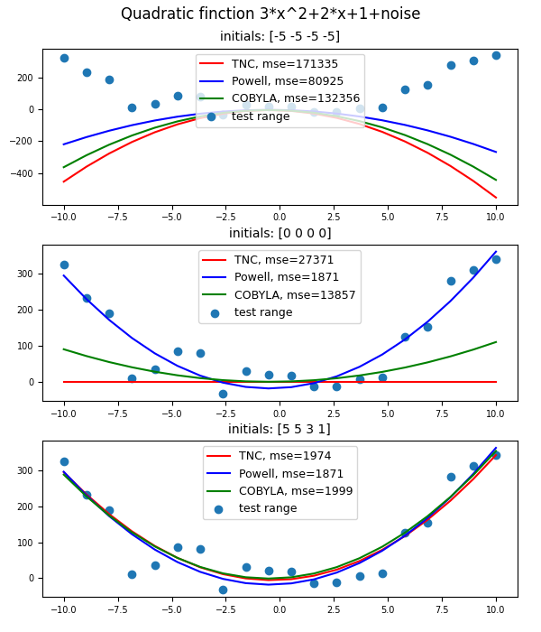

##  Optimization methods study

*Scipy.optimize.minimize* proposes 14 pre-defined methods of scalar function minimization. We have selected three
of them to test: "TNC","Powell" and "COBYLA".    

As test range we have obtained 20 dots at 2D grid using a quadratic function 3*x^2+2*x+1 and adding a noise of N(0,1).    

So, our task to find the quadratic function parameters: a, b, c and standard deviation (sd) of noise which approximize
our test data most accurately using the methods listed above.    

*Scipy.optimize.minimize* methods also assume that we set initial guess as starting point for an algorithm 
to process. We will test three sets of initials (format - [a,b,c,sd]) to estimate importance of them and
ability of different methods to cope with them.  

Accuracy will be measured using Mean Squared Error (MSE) being the sum of squared differences between test 
value and value estimated by a method divided by number of test data. The lower MSE, the better approximation.

See results of our tests at the graphs below.   

First initials are provocative as have an opposite sign than the corresponding parameters of function
used for developing test data and all methods fail.

Second initials are equal to zero and only Powell method has managed to predict data with good accuracy.

Third initials have been selected closer to the function generated test data and all three methods have 
approximated nice. The best is Powell again, its MSE is the lowest.   

**Conclusion** 
 
Our experiment has demonstrated importance of setting initial guesses carefully. They should be close to the 
real parameters of the population. Powell method has appeared to be the best among the methods selected for 
approximation of our quadratic function.

Code for drawing the figures above may be found at **mle_accuracy.py**

Also refer to [GitHub page](https://github.com/denismoroz1981/ML29092020/tree/master/hw_5_moroz).

