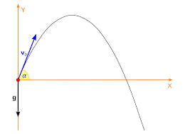
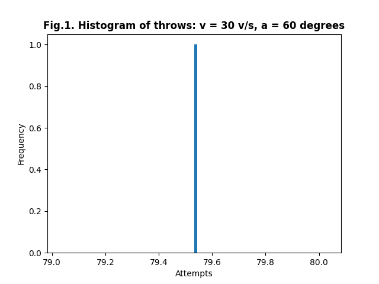
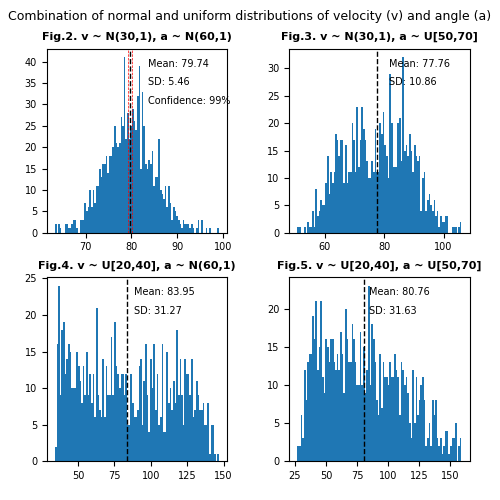

##Stones throwing experiment

Let us consider the following physical experiment. A person throws a stone. 



Ignoring many accidental factors,
such as a wind or landscape, the distance the stone flies depends on a velocity and an angle:


If these two parameters – a velocity (let’s take 30 m/sec) and an angle (60 degrees) - are stable, 
even if we make 1000 throws, the distance is the same (see Fig.1 below).


However, a person is not able to throw stones every time with the same velocity and speed. Certainly, 
after several attempts s/he is tired or oppositely enthusiastically want to outthrow her- or himself. 
So the velocity and the angle change. In this case we may speak about statistical distributions. 
If a person throws stones with as much as possible force, e.g., chasing longer distance, we may probably 
talk about normal distributions. If a person want to get an aim, s/he tries different velocities and angles
 from some range and in this case uniform distributions are involved.

Having two parameters impacting distance and mean values for them, we may add noise following different 
statistical distribution laws: normal and uniform. We may even combine distributions and observe behavior of 
the resulted distance. Such approach is called Monte-Carlo method. See results of 1000 attempts at Fig.2-5 below. The types and
parameters of distributions are described at the titles (N - normal with indication of the mean and standard deviation 
and U - uniform with the range from-to).



From the graphs above we may conclude about resulted distance distribution:

* Fig.2 - two parameters with normal distribution obviously lead to normal distribution of distance. Confidence
interval is shown with red dashed line, and it is quite narrow as we have involved a lot of attemps (1000). 
* Fig.3 - despite distribution of the angle is uniform distance distribution is normal, but standard deviation 
is higher than the one at Fig.2.
* Fig.4 - uniform distribution of velosity has changed the appearance critically and we observe some declining trend. 
However, we may assume that the distance still has normal distribution but skewed to the right very much.
* Fig.5 - unexpectedly two uniform distributions, probably, give right-skewed distribution, even more prominent
than we see at Fig.4.

**Conclusion** 
<br>
Experiment with numerous throws of stone shows that combination of parameters (velosity and angle) 
with normal and uniform distributions are likely to result in normal distribution of the distance.         

<i>Code for drawing the figures above may be found at **throwing.py**</i>

First, you need to prepare a json-file with paramenters: a scalar and a vector. See example below:<br>
<i>&nbsp;&nbsp;  {&nbsp; "scalar": [1],<br>
&nbsp;&nbsp;    "vector":&nbsp;[[3,-2,-1]]&nbsp; } </i>

After that launch **f_activation.py** in Terminal window with compulsory argument -- path to your json-file.
```
python system.py --path params.json
```
Calculated derivatives or information about errors might be found at the log-file **app_activation.log**.

